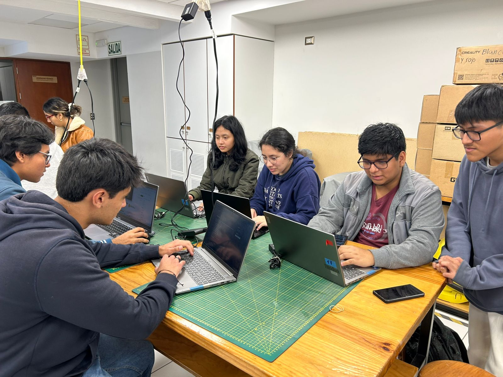

 
<h1>Biodiseño</h1>
Bienvenidos al repositorio del grupo 13 del curso "Fundamentos de biodiseño" horario B403
Tema de interes: Trastornos neurológicos (esclerosis)

<h2>Integrantes:</h2>

 
- Mariam Michelle Morocho Bustamante
- Alexandra Milagros Mamani Casas
- Luis Antonio Gutierrez Nuñez
- Jonatan Esteban Huiñapi Huaman
- Ricardo Sebastian Murillo Sedano
- Xavier Alexis Hernandez Jeronimo

1. Ficha de la enfermedad:
2. Factores y analisis de la enfermedad:
3. Prevencion, diagnostico, tratamiento y monitoreo:
4. Reflexion ingenieril:   
   
